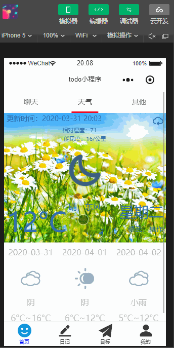

## todo+小程序

## 项目介绍
*图片目录有项目演示的动图*

### todo功能
该项目的最初目的是为解决大学生在校不能够合理安排时间，浑浑噩噩过了一又一天，所以为了让大学生能够每天都有明确的目标，该小程序提供了todo功能（*这句话可以觉得我是实在纯属扯淡*）

在todo里可以写下自己每天为自己定制的小目标，并按时完成，该列表每天零点自动清零，完成的任务会在todo列表中打上对号加上下划线，没完成的还会有未完成的状态，并且用户可以选择删除任务，删除任务后将会被彻底删除，历史中也不会有，用户可以在todo历史中查看自己过往的所有完成情况，会细化到每一天，完成的会打上勾，否则打上叉，切todo只能在列表中进行状态切换与删除，历史记录不允许修改，强制性的让用户看到自己的每天生活状态

### 日记功能
小程序提供日记功能，采用富文本形式编写，用户可以每天都写简短日记来总结一下自己这一天的状态，日记会以月为单位记录在文章列表中，不允许修改，就跟历史一样，并且日记会保证实时性与真实有效性

### 其他功能

这里体现的是+的功能，大学生在校难免会出去玩，出去吃饭，这时就需要有一个方便的地图，相比传统的手机地图，该小程序提供的地图有如下优势：样式不单一，给人以舒适的体验，方便的路线规划，确定自己的位置并可以将该位置复制到剪贴板，从而以文字形式发送给别人，对部分城市提供了地铁图，提供了清晰的卫星地图，方便的看到自己的实际位置，周围的实际建筑，如果用户觉得该小程序的地图功能不够完善，还可以在小程序内打开手机已下载的地图

除了地图，todo，日记这些使用的功能外，为了丰富大学上的日常生活，小程序还提供了：星座配对功能，来给恋爱者一些建议；星座运势，qq号查凶吉来让大学生查看运势，还有周公解梦功能，可以对自己的梦境有一个很好地把握，还有一个笑话大全的娱乐功能，该功能并不会影响学习，不会上瘾，因为为纯文字形式，用于大学生学累了放松一下，最后还有天气预报功能，查看天气的功能，还有一个智能小i智能回答的功能，具体效果可以参照小程序的实现

## 部署教程

通过`git clone xxx`将该小程序clone到本地后，使用微信开发者工具打开，将appid和环境id该为自己的，然后打开云开发控制台，选择数据库，新建userinfo，todo，day数据库，然后依次将云函数部署到自己的云上，在终端开小程序文件夹，初始化npm,安装vant并构建npm,然后就可以运行该小程序查看效果了！

## LICENSE
[MIT](LICENSE)
